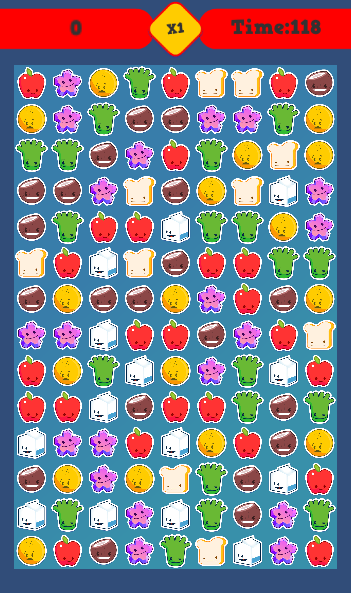
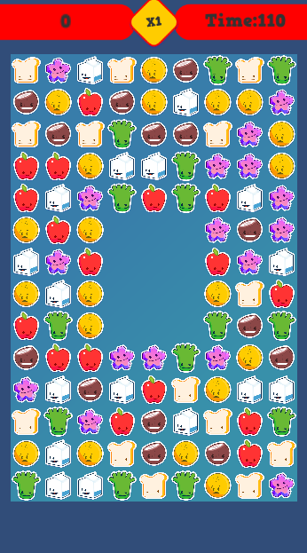

# FoodCrush-Unity

A match3 type of game challange that I got from a interview

This is the game concept: There are gems of different colors on a grid. Players have to move these gems up down left right to form a row or column of same colored 3 or more gems.
When the player match gems of same kind, they gets destroyed and player get points for it. Everytime the player scores, the gems need to be moved down and freeing up place for
new gems that will be automaticly generated on top. 

It was made in C# using Unity
and the idea, rules and the art resources was provided by this link:  https://github.com/PlayKids/match3-test/blob/master/README.md

